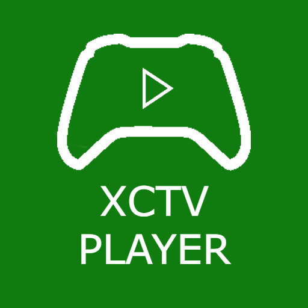
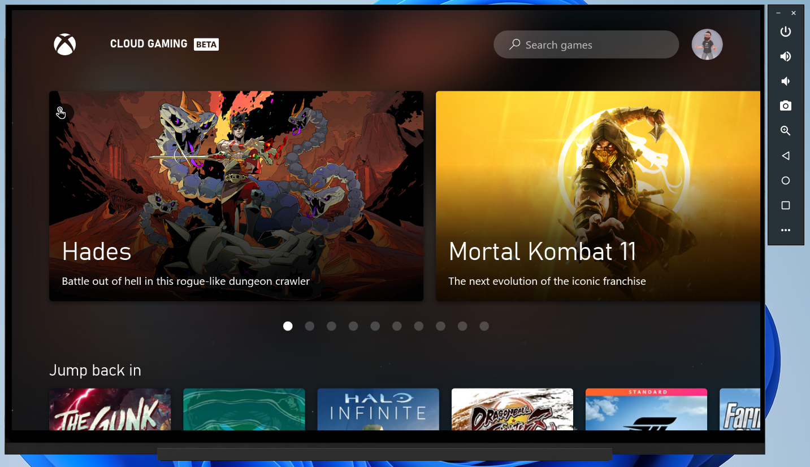
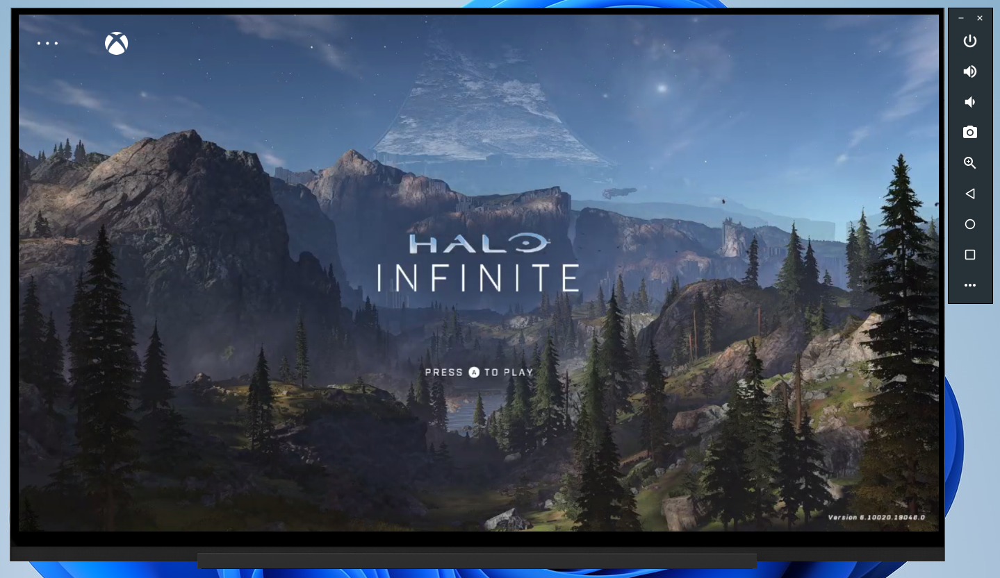

<div id="top"></div>
<!-- PROJECT LOGO -->
<br />
<div align="center">
  <a href="https://github.com/othneildrew/Best-README-Template">
    
  </a>

  <h3 align="center">XCTV Player</h3>

  <p align="center">
    An awesome Microsoft xCloud player for Google Chromecast with Google TV
    <br />
    <br />
    <a href="https://github.com/D4rkC00d3r/xctvplayer/releases/tag/1.0">🔽Download App🔽</a>
    ·
    <a href="https://github.com/D4rkC00d3r/xctvplayer/issues">🐛Report Bug🪲</a>
    ·
    <a href="https://github.com/D4rkC00d3r/xctvplayer/issues">🆕Request Feature🆕</a>
    ·
    <a href="#changelog">🪵Changelog🪵</a>
  </p>
</div>


<!-- TABLE OF CONTENTS -->
<details>
  <summary>Table of Contents</summary>
  <ol>
    <li>
      <a href="#about-the-project">About The Project</a>
      <ul>
        <li><a href="#built-with">Built With</a></li>
      </ul>
    </li>
    <li>
      <a href="#getting-started">Getting Started</a>
      <ul>
        <li><a href="#installation">Installation</a></li>
      </ul>
    </li>
    <li><a href="#roadmap">Roadmap</a></li>
    <li><a href="#changelog">ChangeLog</a></li>
    <li><a href="#license">License</a></li>
    <li><a href="#contact">Contact</a></li>
  </ol>
</details>


<!-- ABOUT THE PROJECT -->
## About The Project

<p align="center">

</p>

<p align="center">
  
</p>


I picked up a Google Chromecast with Google TV player and I was surprised that there was no official way to play xCloud games as the official app that could be sideloaded stopped working. As a software engineer, I decided to have a go at making a Google TV (Formally Android TV) app that would allow xCloud to play in full screen with controller support. 

Features
- [X] Requires NO permissions 😁👍👌
- [X] Supports XBOX gamepad connected via Bluetooth or OTG cable
- [X] Remembers sign in
- [X] Plays games in Fullscreen no borders
- [X] 🆕 Now launch from channel icon!
- [X] 🆕 Now loads faster!

<p align="right">(<a href="#top">back to top</a>)</p>

### Built With

* [Android Studio](https://developer.android.com/studio)
* [Kotlin](https://kotlinlang.org/)👌

<p align="right">(<a href="#top">back to top</a>)</p>

<!-- GETTING STARTED -->
## Getting Started

### Test release app
If you just want to download the .apk file that's awesome, just use the download button at the top of this page. Please remember to star the project.

### Installation

1. Clone the repo
   ```sh
   git clone https://github.com/D4rkC00d3r/xctvplayer.git
   ```
3. Open in Android Studio
4. Run on a Google TV emulator

<p align="right">(<a href="#top">back to top</a>)</p>

<!-- ROADMAP -->
## Roadmap

- [x] User testing
- [x] Release v1.0
- [X] Test on additional Android TV devices (Via yje awesome people on Reddit) 👌
- [X] Add a launch icon for Google TV
- [X] Create a general Android version for all other devices.

<p align="right">(<a href="#top">back to top</a>)</p>

<!-- CHANGELOG -->
## Changelog

v1.1.0

    Added channel icon to allow launching from Google TV interface.
    Improved loading times.
    Created a "general device" version for all other Android devices such as phones / tablets".
    
v1.0 

    Released app.

<p align="right">(<a href="#top">back to top</a>)</p>

<!-- CONTRIBUTING -->
## Contributing

Contributions are what make the open source community such an amazing place to learn, inspire, and create. Any contributions you make are **greatly appreciated**.

If you have a suggestion that would make this better, please fork the repo and create a pull request. You can also simply open an issue with the tag "enhancement".
Don't forget to give the project a star! Thanks again!

1. Fork the Project
2. Create your Feature Branch (`git checkout -b feature/AmazingFeature`)
3. Commit your Changes (`git commit -m 'Add some AmazingFeature'`)
4. Push to the Branch (`git push origin feature/AmazingFeature`)
5. Open a Pull Request

<p align="right">(<a href="#top">back to top</a>)</p>


<!-- LICENSE -->
## License

Distributed under the GNU V2.0 License. See `LICENSE.txt` for more information.

<p align="right">(<a href="#top">back to top</a>)</p>


<!-- CONTACT -->
## Contact

Your Name - [@d4rkc00d3r](https://twitter.com/d4rkc00d3r)

Project Link: [https://github.com/d4rkc00d3r/xctvplayer](https://github.com/d4rkc00d3r/xctvplayer)

<p align="right">(<a href="#top">back to top</a>)</p>
